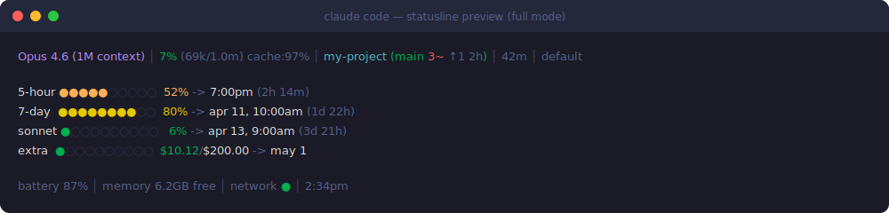
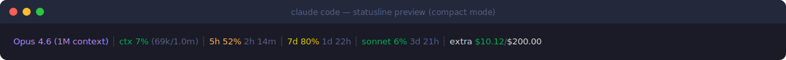

# claude-code-statusline

[](https://github.com/MixMe/claude-code-status-line/actions/workflows/shellcheck.yml)
[](LICENSE)
[](https://github.com/MixMe/claude-code-status-line/releases)


A rich, zero-dependency status line for [Claude Code](https://claude.ai/code) — model info, context usage, rate-limit bars, git status, system metrics, and auto-update notifications.

## Preview

**Full mode** (default) — three-block layout with rate-limit bars and system info:



**Compact mode** — single line, terse, model plus credit remainders:



Switch between them at install time or any time via
`STATUSLINE_MODE=compact` / `STATUSLINE_MODE=full` in
`~/.config/claude-statusline/config`.

## Install / Update

One command — installs fresh or updates existing:

```bash
curl -fsSL https://raw.githubusercontent.com/MixMe/claude-code-status-line/main/install.sh | bash
```

Restart Claude Code to apply. No dependencies to install — uses `node` that ships with Claude Code.

**Windows (PowerShell):**

```powershell
irm https://raw.githubusercontent.com/MixMe/claude-code-status-line/main/install.ps1 | iex
```

Also works in WSL or [Git Bash](https://git-scm.com/downloads/win) with the `curl | bash` command above.

## What it shows

**Line 1 — Session**
| Field | Description |
|---|---|
| Model name | Color-coded: cyan = Haiku, blue = Sonnet, magenta = Opus |
| Context % | Usage bar with color gradient (green -> orange -> yellow -> red) |
| Cache hit | `cache_read / total_tokens` — higher = faster responses |
| Long chat | Red warning when context exceeds 200k tokens |
| Directory | Current working directory |
| Git | Branch, dirty count (`3~`), ahead/behind (`↑1↓0`), last commit age |
| Duration | Session time elapsed |
| Effort | `default` / `high` / `low` |
| Thinking | Shown when extended thinking is active |
| !perms | Warning when `bypassPermissions` is enabled |

**Line 2 — Rate limits**

One bar per category, dynamically discovered. The list always contains
`5-hour` and `7-day` (read from stdin, always present); every other row
is enumerated from `/api/oauth/usage` and rendered automatically — new
categories Anthropic adds in the future appear without a code change.

| Field | Description |
|---|---|
| 5-hour | 5-hour usage bar with reset time and countdown |
| 7-day | 7-day usage bar with reset date and countdown |
| sonnet / opus / ... | Per-model weekly sub-limits (Max plan only). Each `seven_day_*` field present in `/api/oauth/usage` becomes its own row, with the `seven_day_` prefix stripped. |
| extra | Monthly prepaid credits, shown when `extra_usage.is_enabled` is true. |
| codenames | Internal slots Anthropic ships before they have a public name (e.g. `omelette`, `iguana_necktie`) appear under their raw key so new limit types are visible the day they activate. |

**Line 3 — System**
| Field | Description |
|---|---|
| Battery | Color warning at ≤40% / ≤20%. Hidden on desktop. |
| Memory | Free RAM |
| Internet | Connectivity indicator, cached 30s |
| Time | Local clock |
| Update | Notification when newer version is available |

## Requirements

- Claude Code v2.1.80+
- `bash` 4+, `curl`
- macOS, Linux, or Windows (WSL / Git Bash)

## Statusline modes

Two rendering modes, selected at install time and switchable via config:

- **full** (default) — three-block multi-line layout: session info, rate-limit bars, system metrics. What you see in the "Line 1 / Line 2 / Line 3" tables above.
- **compact** — single-line terse output: model, context (with absolute token counts), and rate-limit usage for every category present in the API response (5-hour, 7-day, Sonnet, Opus, extra, plus any future or codename slots Anthropic ships). Percentages use the **same semantic as full mode** (used, not remaining), so a given metric shows the exact same number in both layouts. Colour urgency tracks usage: green = low, red = near exhaustion.

Switch at any time by editing `~/.config/claude-statusline/config`:

```
STATUSLINE_MODE=compact
```

or re-run the installer and pick interactively.

## How rate limits work

The 5-hour and 7-day usage percentages are read directly from Claude Code's stdin JSON — **zero API calls**, always fresh on every render.

Every other rate-limit category (Sonnet weekly, Opus weekly, prepaid credits, future / codename slots) is fetched from the `/api/oauth/usage` endpoint and cached together:
- Single API call — every category comes out of one response
- Cached for 3 minutes
- Backs off 5 min on rate limit (429), 10 min on auth error
- Stale data shown with age indicator (max 10 min)
- Categories are enumerated dynamically: any non-null top-level field that matches one of the two known shapes (`{utilization, resets_at}` or `{is_enabled, monthly_limit, used_credits, currency}`) becomes its own row. Hardcoded "sonnet" / "extra" parsing was replaced in v1.5.0 so new limit types Anthropic ships are visible automatically.

## Customization

### Custom project labels

Map directory paths to short labels. Create `~/.config/claude-statusline/labels`:

```
my-api=api
my-frontend=ui
```

Add to the working directory section of `statusline.sh`:

```bash
labels_file="$HOME/.config/claude-statusline/labels"
if [ -f "$labels_file" ]; then
    while IFS='=' read -r pattern label; do
        [[ "$cwd" == *"$pattern"* ]] && dirname="$label" && break
    done < "$labels_file"
fi
```

### Service health indicator

Add a health check for local services (database, dev server, etc.):

```bash
if curl -sf --max-time 1 "http://localhost:YOUR_PORT/health" >/dev/null 2>&1; then
    sys_parts+=("${green}myservice ●${reset}")
else
    sys_parts+=("${dim}myservice ○${reset}")
fi
```

### Time format and mode

The installer asks for time format and statusline mode interactively. To change later, edit `~/.config/claude-statusline/config`:

```
TIME_FORMAT=24h
STATUSLINE_MODE=compact
```

`TIME_FORMAT` accepts `12h` or `24h`. `STATUSLINE_MODE` accepts `full` or `compact`.

## Changelog

### v1.5.0
- **Dynamic rate-limit discovery**: every non-null top-level field in the `/api/oauth/usage` response is now rendered as its own bar, so categories the previous parser ignored (`seven_day_opus`, `seven_day_omelette`, internal codename slots like `iguana_necktie`) are visible the moment Anthropic activates them. New limit types added in the future no longer need a code change to appear in the statusline.
- **Consistent label padding**: all rows in full mode now share the same label width — computed once across the whole set — so bars line up vertically regardless of which categories the API returned.
- **Compact mode covers everything too**: the single-line layout iterates the same record list as full mode, so any newly-discovered category appears in compact rendering as well, not just full.
- **Internals**: replaced the hardcoded `seven_day_sonnet` / `extra_usage` parser with a generic enumerator that classifies each field into one of two known shapes (`{utilization, resets_at}` for percentage bars, `{is_enabled, monthly_limit, used_credits, currency}` for credit bars). Anything else is silently skipped. The dropped `*_enabled` / `*_pct` / `*_used` / `*_limit` defaults are no longer referenced.

### v1.4.1
- **Fix: compact mode rate-limit percentages now match full mode**. v1.4.0 displayed compact-mode 5-hour / 7-day / Sonnet as *remaining* (100 − used) while `ctx` and full-mode bars continued to show *used*, which made identical metrics read as different numbers depending on layout (e.g. 7-day at 82% used appeared as `7d 18%` in compact but `82%` in full). All percentages are now used, consistently, in both modes.

### v1.4.0
- **Sonnet weekly sub-limit**: new third rate-limit line showing the Sonnet-specific weekly quota enforced on Max plans, parsed from the same `/api/oauth/usage` response already fetched for extra usage — no additional API calls. Silently hidden on non-Max plans.
- **Compact single-line mode**: opt-in single-line layout showing model, context (with absolute token counts), and credit remainders for 5-hour / 7-day / Sonnet / extra. Rate-limit percentages are shown as remaining, so the number reads as "how much budget I still have" while colour urgency still tracks usage. Full mode remains default and untouched; compact is strictly additive.
- **Interactive mode picker at install**: the installer now asks for `full` vs `compact` in addition to the existing time-format question, using the same arrow-key selector.
- **Fix: arrow-key selection on bash 3.2 (macOS default)**: the fractional `read -t 0.05` timeout in the interactive picker failed immediately on macOS' bundled bash 3.2 with "invalid timeout specification", silently swallowing arrow-key escape sequences so only the 1/2 hotkeys worked. Switched to integer `-t 1` which is supported on bash 3.2+.
- **Perf: fewer forks per render**: node invocations reduced from 4 to 2 per render by merging the Sonnet and extra-usage parsers into a single process and removing the has_extra caching gate. Git invocations reduced from 5 to 2 by replacing the `rev-parse` / `symbolic-ref` / `status --porcelain` / `rev-list --count --left-right` combo with a single `git status --porcelain=v2 --branch` that yields inside-work-tree, branch, ahead/behind and dirty count in one call.
- **Docs**: README now documents the two modes with separate preview images and expanded rate-limit explanation.

### v1.3.0
- **Locale fix**: force `LC_NUMERIC=C` and `LC_TIME=C` so `printf`/`awk` parse JSON floats (e.g. `28.5`) and `date` outputs English month names on locales like `ru_RU.UTF-8` / `de_DE.UTF-8` / `fr_FR.UTF-8` (common on Fedora). Fixes broken 5-hour / 7-day progress blocks.
- **English-only labels, no abbreviations**: `bat` → `battery`, `mem` → `memory`, `net` → `network`, `5h` → `5-hour`, `7d` → `7-day`, `!perms` → `!permissions`, `gb`/`mb` → `GB`/`MB`.
- **Interactive time-format picker**: `install.sh` now uses an arrow-key selector (↑/↓, j/k, 1/2, Enter) instead of typing `12h`/`24h`. Cursor restored on Ctrl+C via `trap`.
- **Windows support**: PowerShell installer (`install.ps1`), Git Bash compatibility, credential path fallbacks.
- **ShellCheck clean**: all SC2059 / SC2154 warnings fixed.

### v1.2.0
- **Zero dependencies**: replaced `jq` with `node` (ships with Claude Code). Nothing to install.
- **Single node call**: parses stdin JSON + settings.json in one process (was ~20 `jq` calls).

### v1.1.0
- **stdin-first rate limits**: reads from Claude Code stdin, no API polling.
- **Rate-limit backoff**: lock file prevents API hammering on 429.
- **Long chat warning**: shown when context exceeds 200k tokens.
- **Auto-update check**: daily GitHub check with notification.
- **One-command install**: `curl | bash` for all platforms.

### v1.0.0
- Initial release: model, context, cost, git, rate limits, battery, memory, network.

## License

MIT
