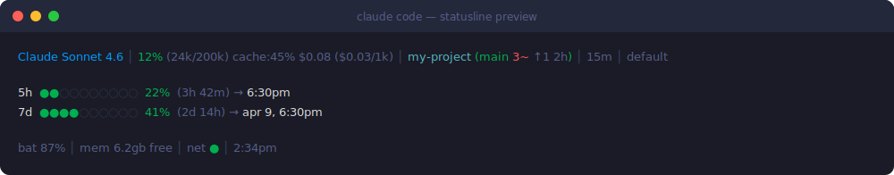

# claude-code-statusline

[](https://github.com/MixMe/claude-code-status-line/actions/workflows/shellcheck.yml)
[](LICENSE)


A rich status line for [Claude Code](https://claude.ai/code) — model info, context usage, cache efficiency, session cost, git status, rate-limit bars, battery, memory, and more.

## Preview



## What it shows

**Line 1 — Session**
| Field | Description |
|---|---|
| Model name | Color-coded by tier: cyan = Haiku, blue = Sonnet, magenta = Opus |
| Context % | Usage vs window size, color-coded green -> orange -> yellow -> red |
| Cache hit rate | `cache_read / total_tokens` — higher = cheaper, faster responses |
| Long chat | Red warning when context exceeds 200k tokens (compression imminent) |
| Directory | Current working directory name |
| Git branch | Branch name with dirty file count (`3~`), ahead/behind (`↑1↓0`), last commit age (`2h`) |
| Session duration | How long the current session has been running |
| Message count | Number of messages in the session |
| Effort level | `default` / `high` / `low` |
| Thinking | `thinking` label shown when extended thinking is active |
| Permissions | `!perms` warning shown when `bypassPermissions` is enabled |

**Line 2 — Rate limits**
| Field | Description |
|---|---|
| 5h bar | 5-hour usage bar with % and time until reset |
| 7d bar | 7-day usage bar with % and date/time until reset |
| Extra | Monthly extra usage credits (shown only when enabled) |

**Line 3 — System**
| Field | Description |
|---|---|
| Battery | Level with color warning at ≤40% (yellow) and ≤20% (red). Hidden on desktop/server. |
| Memory | Free RAM (macOS: free + inactive pages; Linux: MemAvailable) |
| Internet | `●` up / `○` down — pings 1.1.1.1, cached 30s |
| Local time | Current time |
| Update | Shows `update X.Y.Z` when a newer version is available (checked once per day) |

## Requirements

- `bash` 4+
- `jq`
- `curl`
- Claude Code v2.1.80+ (for stdin rate limits)
- macOS or Linux

## Install / Update

One command — installs or updates to the latest version:

```bash
curl -fsSL https://raw.githubusercontent.com/MixMe/claude-code-status-line/main/install.sh | bash
```

Restart Claude Code to apply.

**Prerequisites:** `jq` and `curl` must be installed:

```bash
# macOS
brew install jq

# Linux (Debian/Ubuntu)
sudo apt install jq curl
```

## How rate limits work

**v1.1.0+**: Rate limits (5h and 7d) are read directly from Claude Code's stdin JSON — no API calls needed. This data is always fresh and never rate-limited.

**Extra usage** (monthly credits) is still fetched from the API (`https://api.anthropic.com/api/oauth/usage`) since it's not included in stdin. The API response is cached for 180 seconds with proper rate-limit backoff:
- On 429 (rate limited): backs off for 5 minutes
- On 401/403 (auth error): backs off for 10 minutes
- Stale data is shown with age indicator (max 10 minutes)
- Lock file prevents concurrent API calls

## Customization

### Custom project labels

By default the status line shows the current directory name. To map paths to custom labels, create `~/.config/claude-statusline/labels` with one `pattern=label` entry per line:

```
my-api=api
my-frontend=ui
my-shared-lib=shared
```

Then add to the working directory section of `statusline.sh`:

```bash
labels_file="$HOME/.config/claude-statusline/labels"
if [ -f "$labels_file" ]; then
    while IFS='=' read -r pattern label; do
        [[ "$cwd" == *"$pattern"* ]] && dirname="$label" && break
    done < "$labels_file"
fi
```

### Custom service health indicator

To add a health ping for a local service (database, dev server, etc.), add before the output section:

```bash
if curl -sf --max-time 1 "http://localhost:YOUR_PORT/health" >/dev/null 2>&1; then
    sys_parts+=("${green}myservice ●${reset}")
else
    sys_parts+=("${dim}myservice ○${reset}")
fi
```

## Changelog

### v1.1.0
- **stdin-first rate limits**: 5h/7d usage now reads from Claude Code's stdin JSON instead of polling the API. Always fresh, zero API calls.
- **Rate-limit backoff**: API calls for extra_usage respect 429 with exponential backoff and lock file.
- **Max stale age**: API-fetched data expires after 10 minutes (was: infinite fallback to stale cache).
- **Staleness indicator**: Shows age when displaying stale API data.
- **Auto-update check**: Checks GitHub for new version once per day, shows indicator in system line.
- **Quick update**: `bash install.sh --update` for fast re-install without config prompts.
- **New stdin fields**: Uses `cost.total_cost_usd`, `cost.total_duration_ms`, `context_window.used_percentage`, `workspace.current_dir` from stdin.

### v1.0.0
- Initial release with full statusline: model, context, cost, git, rate limits, battery, memory, network.

## License

MIT
